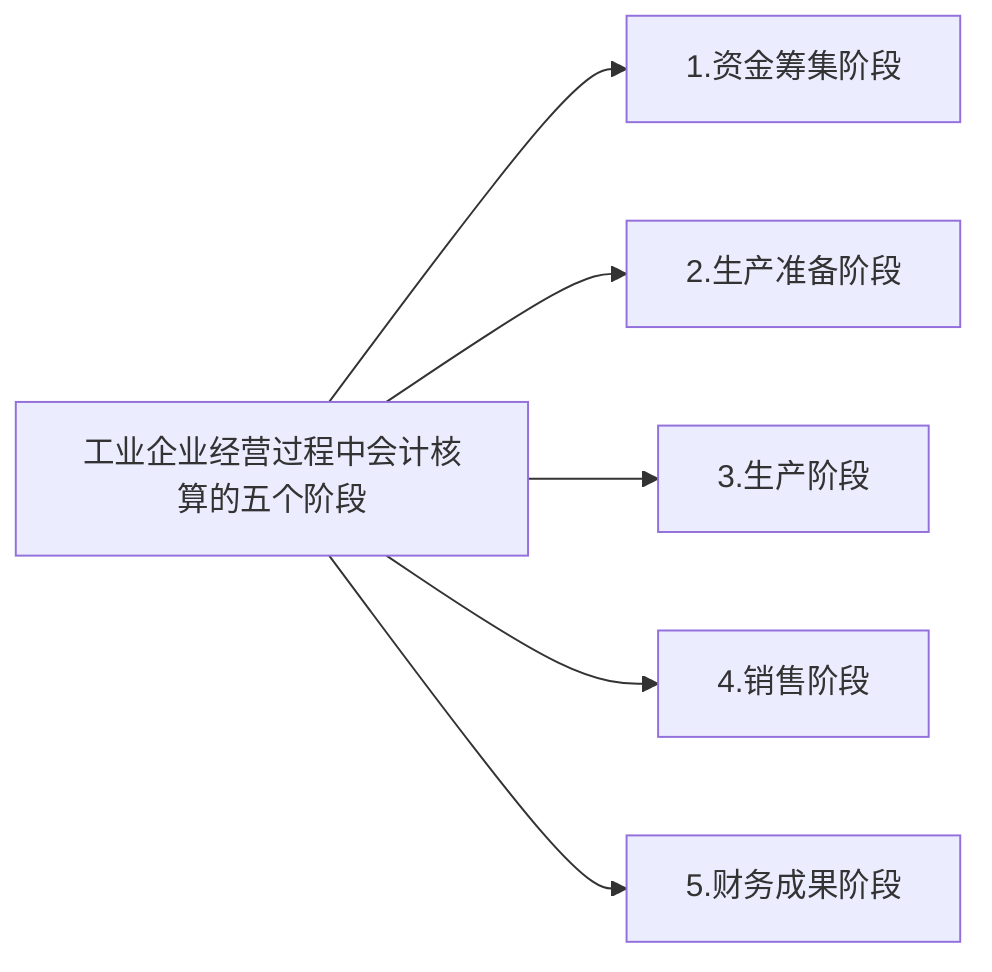

### 一、资金筹集业务的会计核算

> #### 筹集资金的来源：
> #####  1.投资者
> - 注册资本<br>
> - 实收资本（我国规定无论何种所有制企业均采用实收资本，且与注册资本必须一致)
> ##### 对应的会计账户：
> - 银行存款
> - 无形资产
> - 实收资本
> ##### 2.债权人
> ##### 对应的会计账户：
> - 短期借款
> - 长期借款<br>
两者区别：时间以年为限<br>
用途:短期，企业临时周转<br>
长期，为某项目(工程）
> #### 短期借款利息的核算
> ##### 1.采用预提法(权责发生制)
> 利息本身没有付给银行，但按权责发生制应该在账上确认，预先把利息费用进行确认。<br>
> ##### 2.直接确认法（收付实现制）<br>
> 一次性合并计算，主要针对信息质量要求与重要性原则：次要事项可简略描述
### 二、生产准备阶段会计核算
> #### 常用账户：
> ##### 1、固定资产购置常用账户
> **a.固定资产** <br>
> 借方：增加固定资产的原始价值<br>
> 贷方：减少固定资产的原始价值<br>
> 余额：在借方，反映期未固定资产的原始价值<br><br>
> **b.在建工程** <br>
借方：建造和安装过程中发生的全部支出<br>
贷方：结转已完工工程的实际成本<br>
余额在借方，反映当未完工工程的实际支出<br><br>
**c.应交税费一应交增值税**<br>
> ##### 2、原材料采购业务账户
> **a.在途物资** <br>
用以核算企业所有购入材料的买价和采购费用。<br>
借方：购入材料的买价和采购费用<br>
贷方：验收入库的材料采购成本<br>
余额：在借方，表示在途材料的采购成本<br>
***应按材料类别设置明细分类账***<br><br>
**b.原材料** <br>
用以反映和监督各种材料的增减变动情况。<br>
借方：验收入库的各种材料成本<br>
贷方：已领用的材料成本<br>
余额：在借方，表示库存的各种材料成本<br>
> ***应按原材料的品种和规格*，设置明细分类账**<br><br>
> **c.应交税费一应交增值税**<br><br>
> **d.其他科目**<br>
> 应付账款、预付帐款应付票据<br>
> 银行存款、库存现金等<br>
### 三、产品生产业务的会计核算
> #### 1、费用分类
> ```mermaid
> graph LR
>     a[费用] --> b[生产费用]
>     a --> c[期间费用]
>     c --> 计入当期损益,从当期实现的收入中得到补偿
>     b --> e[直接材料]
>     b --> f[直接人工]
>     b --> g[制造费用]
>     e --> h[产品生产成本]
>     f --> h[产品生产成本]
>     g --> h[产品生产成本]
>     h --> 本期完工产品
>     h --> 在产品
> ```
> ```mermaid
> graph LR
>     a[费用按经济用途分类] --> b[生产成本费用]
>     a --> c[期间费用]
>     b --> d[直接费用]
>     b --> e[间接费用] 
>     d --> 直接材料费用
>     d --> 直接人工费用
>     e --> 制造费用
>     c --> 销售费用
>     c --> 管理费用
>     c --> 财务费用
> ```
> #### 2、常用账户
> ##### (1)生产成本
> 借：生产发生的各种成本费用（包括间接费用）<br>
> 贷：验收入库的产品实际成本<br>
> 余额：借余，尚未完工的在产品成本<br>
> ***按照产品类别设置明细账***
> ##### (2)制造费用
> ***反映为生产产品和提供劳务而发生的各项间接费用的帐户***<br>
> 借：登记发生的全部制造费用<br>
> 贷：登记转入"生产成本"借方由各产品负担的制造费用<br>
> 余额：月末一般无余额<br>
> ##### (3)应付职工薪酬
> 借：本月实际支付的职工薪酬<br>
> 贷：本月结算的应付职工薪酬<br>
> 余额：<br>借余，表示相实发薪酬大于应付薪酬的差额，即为多付的薪酬<br>
> 贷余，表示相应付薪酬大于实发薪酬的差额，即应付未付的薪酬<br>
> ##### (4)库存商品
> ***反映已经生产完工*，并已验收入库的可以出售的产成品的实际成本**<br>
> 借：入库产成品实际成本<br>
> 贷：以销售产品实际成本<br>
> 余额：借余，库存产品的实际成本<br>
> ***按照产品类别设置明细账***<br>
> #### 3、主要会计核算
> ##### (1)领用原材料，投入生产<br>
> 借：生产成本<br>
> &nbsp;&nbsp;&nbsp;&nbsp;&nbsp;&nbsp;&nbsp;制造费用<br>
> &nbsp;&nbsp;&nbsp;&nbsp;&nbsp;&nbsp;&nbsp;管理费用<br>
> &nbsp;&nbsp;&nbsp;&nbsp;&nbsp;&nbsp;&nbsp;&nbsp;&nbsp;&nbsp;贷：原材料<br>
> ##### (2)分配职工薪酬
> 借：生产成本<br>
> &nbsp;&nbsp;&nbsp;&nbsp;&nbsp;&nbsp;&nbsp;制造费用<br>
> &nbsp;&nbsp;&nbsp;&nbsp;&nbsp;&nbsp;&nbsp;管理费用<br>
> &nbsp;&nbsp;&nbsp;&nbsp;&nbsp;&nbsp;&nbsp;&nbsp;&nbsp;&nbsp;贷：应付职工薪酬<br>
> ##### (3)计提累计折旧
> 借：生产成本<br>
> &nbsp;&nbsp;&nbsp;&nbsp;&nbsp;&nbsp;&nbsp;制造费用<br>
> &nbsp;&nbsp;&nbsp;&nbsp;&nbsp;&nbsp;&nbsp;管理费用<br>
> &nbsp;&nbsp;&nbsp;&nbsp;&nbsp;&nbsp;&nbsp;&nbsp;&nbsp;&nbsp;贷：累计折旧<br>
> ##### (4)分配制造费用
> 借：生产成本<br>
> &nbsp;&nbsp;&nbsp;&nbsp;贷：制造费用<br>
> ##### (5)产品完工入库
> 借：库存商品<br>
> &nbsp;&nbsp;&nbsp;&nbsp;贷：生产成本<br>
> #### 制造费用的分配步骤
> 1.分配标准(工资、工时等)<br>
> 2.计算分配率<br>
> 3.进行分配<br>
> `$分配率= \frac{待分配的制造费用总额}{分配之和}$`
> #### 4、产品生产成本计算
> ##### (1)产品生产成本计算方法
> **制造成本法：** 只有跟生产产品有关系的才计入生产成本中（直接材料，直接人工，制造费用)<br>
> **完全成本法：** 所有费用都归入产品的成本中（直接材料，直接人工，制造费用，期间费用)<br>
> ##### (2)产品生产成本计算的一般程序
> - **确定计算对象（一般按产品品种)**<br>
> a. 以产品品种<br>
> b、以生产步骤<br>
> C、以产品批次<br>
> - **确定成本计算期（一般按月计算)：** 就是成本计算的间隔期<br>
a. 以月为成本计算期<br>
b. 以产品的生产周期为成本计算期(单件小批量生产)<br>
> - **确定成本项目(料、工、费)：** 生产费用按经济用途分类的项目<br>
a.直接材料<br>
b.直接人工<br>
c.制造费用<br>
> - **正确归集和分配生产费用**<br>
> 单一产品生产的场合<br>
> 几种产品同时生产的场合<br>
> ```mermaid
> graph LR
> a[涉及间接费用的分配标准] --> 生产工人工时
> a --> 生产工人工资
> a --> 机器工时
> a --> 有关消耗定额
> ```
> - **将费用在完工产品和在产品之间进行分配**<br>
(1)成本计算期与生产周期一致时，则期末所有产品都是完工产品，不存在完工产品与期末产品的费用分配问题。<br>
(2)成本计算期与生产周期不一致时，则期末既有完工产品又有期末在产品。<br>
> - **完工产品与期末在产品成本间关系公式表示：**<br>
> 期初在产品成本 + 本期生产费用=本期完工产品成本+期末在产品成本<br>
> 本期完工产品成本=期初在产品成本 + 本期生产费用 - **期末在产品成本**<br>
> 期未在产品成本=期初在产品成本 + 本期生产费用- **本期完工产品成本**<br>
> - 设置和登记费用成本明细账，编制成本计算表
### 四、应交增值税
> ```mermaid
> graph LR
> a[应交增值税-三级科目] --> 进项税,记借方
> a --> 销项税,记贷方
> ```
> $进项 - 销项 = 增值税$<br>
> ***增值税始终由买方付给卖方*，最终承担者是消费者，跟企业利润没有关系。**<br>
> #### 1、增值税类型
> **消费型：** 可以在借方进行固定资产增值税抵扣(当前我国使用的类型）<br>
> **生产型：** 不可以在借方进行固定资产增值税抵扣<br>
> **收入型：** 本期允许在借方进行抵扣的进项税仅限于固定资产计提折旧的部分(理论上比较科学，但实际操作不便)<br>
> **区别原理：** 固定资产的增值税能不能在借方抵扣。<br><br>
> **增值税是价外税(价税分离)，如果已知的是含税价，则应该转化为不含税价进行价税分离：**<br>
> $不含税价= \frac{含税价}{1 + 增值税税率}$<br>
> 增值税 = 不含税价*增值税税率<br>
> **如果是零售价既为含税价**
