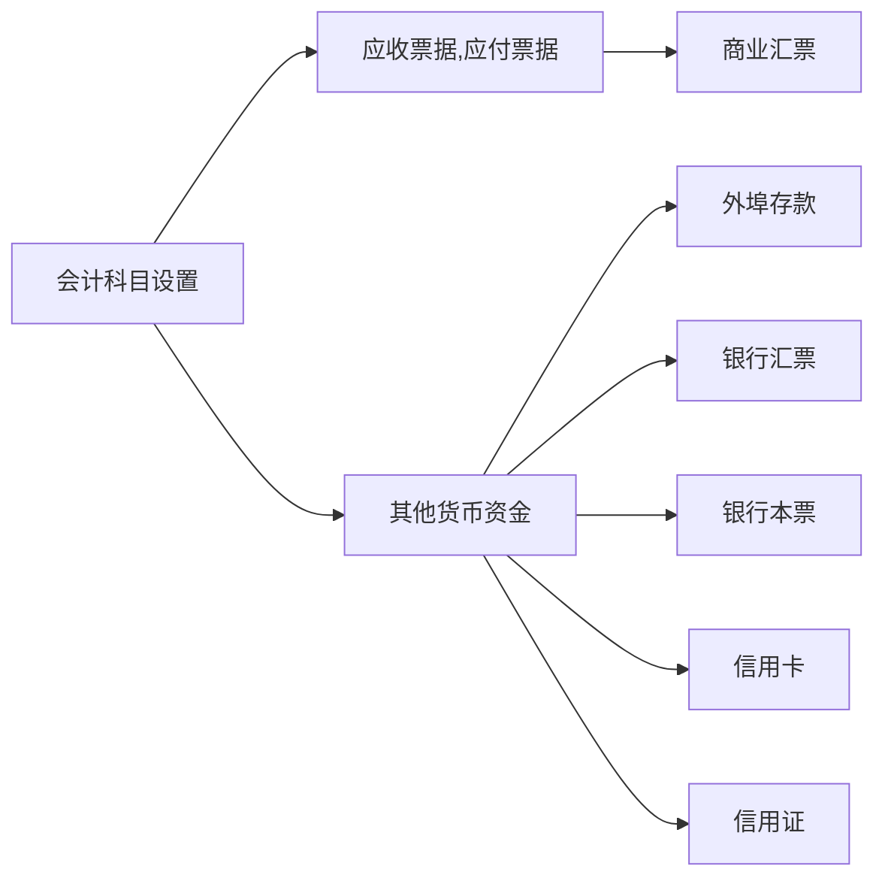

### 一、结算方式
> **商业江票：** 由出票人签发的，委托付款人在指定日期无条件支付确定的金额给收款人票据持有人的票据。由于商业汇票的++出票日与实际收付款有时间差，所以应通过“应收票据”和“应付票据”账户进行会计核算。++  
> **银行汇票：**
由企业单位或个人将款项交存开户银行，由银行签发给其持往异地采购商品时办理结算或支取现金的票据。  
> **银行本票：**
由银行签发的，承诺自己在见票时无条件支付确定的金额给收款人或持票人的票据。  
> **支票：**
由出票人签发的，委托办理支票存款业务的银行在见票时无条件支付确定金额给收款人或持票人的票据。  
> **汇兑：**
汇款人委托银行将其款项支付给收款人的一种结算方式。汇兑分为信汇和电汇两种，企业可以根据需要选用。  
> **委托收款：**
是收款人委托银行向付款人收取款项的一种结算方式。  
> **托收承付：**
根据购销合同由收款人发货后委托银行向异地付款人收取款项，由付款人向银行承认付款的一种结算方式。  
> **信用卡：**
是商业银行向个人和单位发行的，凭此向特约单位购物、消费和向银行存取现金，且具有消费信用的特制载体卡片。  
> **信用证：**
是国际结算的一种主要方式。经中国人民银行批准经营结算业务的商业银行总行以及经商业银行总行批准开办信用证结算业务的分支机构，也可以办理国内企业之间商品交易的信用证结算业务。
### 其他货币资金核算
> **外埠存款：**
是指企业到外地进行临时或零星采购时，汇往采购地银行开立采购专户的款项。  
> **银行汇票存款：**
是指企业为取得银行汇票，按规定存入银行的款项。企业申请银行汇票时，应向银行提交“银行汇票委托书”，根据银行盖章退回的存根联编制记账凭证。  
> **银行本票存款：**
是指企业为取得银行本票，按规定存入银行的款项。企业申请银行本票时，应向银行提交“银行本票委托书”，根据银行盖章退回的存根联编制记账凭证。  
> **信用卡存款：**
是指企业为取得信用卡，按规定存入银行的款项。企业申领信用卡时，应按规定填制申请表，连同支票有关的资料一并送交给发卡银行，银行开立信用卡存款账户，发给企业信用卡  
> **信用证保证金存款：**
是指采用信用证结算方式的企业为取得信用证，而按规定存人想行信用证保证金专户的款项。